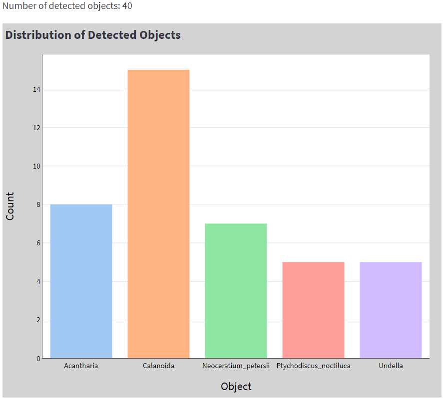

# Streamlit web application for microorganism image classification

## Description

This project hosts a Streamlit web application designed to classify objects in images using a pre-trained model. Users can upload images, and the application will display the images along with their predicted classes, and a visual distribution of detection results.

## Features

- Dark and light theme toggling for the application interface (preliminary version).
- Image classification using a pretrained Pytorch model.
- Visualization of the prediction results through integrated an Plotly graph.

## Prerequisites

Before running this application, make sure you have Docker installed on your system. If you do not have Docker, you can download it from the [official Docker website](https://docs.docker.com/get-docker/).

## Installation

To get this application up and running, follow these steps:

### Cloning the Repository

To clone the repository and navigate into the project directory, run:

    git clone https://github.com/PlanktoScope/streamlit-classification-app.git
    cd streamlit-classification-app
    
### Creating a folder for pretrained models

To avoid errors later in running the docker container, please import your pretrained models (be sure to include the input image size in its name like sizexsize) and create a folder as follows:

    models/<model_name>

### Building the Docker Image

Build the Docker image using the following command (it takes a considerable time):

    docker build -t <image_name>:<tag> .

### Running the Docker Container

Run the Docker container with:

    docker run -p 8501:8501 <image_name>:<tag>

The Streamlit app will be served on port 8501.

### Accessing the application

Once the application is running, click on the link displayed in your terminal or open your web browser and navigate to:

    http://localhost:8501

From there, you can use the web interface to:

- Upload images for classification.
- View model predictions and the distribution of detected objects.

## License
This project is licensed under the [Apache-2.0](https://www.apache.org/licenses/LICENSE-2.0).

Copyright [Wassim Chakroun](http://www.linkedin.com/in/wassim-chakroun/) and PlanktoScope project contributors.
